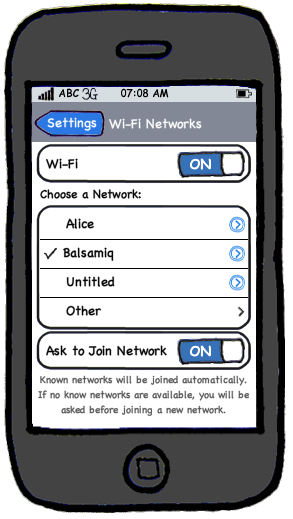

A prototype is a mock up, a scaled down version, or a partial system constructed 

1. to get users’ feedback. 
2. to validate a technical concept (a "proof-of-concept" prototype).
3. to give a preview of what is to come, or to compare multiple alternatives on a 
    small scale before committing fully to one alternative. 
4. for early field-testing under controlled conditions. 

Early UI prototyping, i.e. sketching the user interface for the intended product, is a good technique 
to uncover requirements, in particular, those related to how users interact with the system. 
UI prototypes are often used in brainstorming sessions, or in meetings with the users to get quick feedback from them. 
Here is a more realistic example of a GUI prototype created using Balsamiq 
(a tool for creating UI prototypes)
<footnote BAL-IMG>Image taken from [http://balsamiq.com/](http://balsamiq.com/products/mockups). 
Balsmiq has a free version for creating UI prototypes.</footnote>

